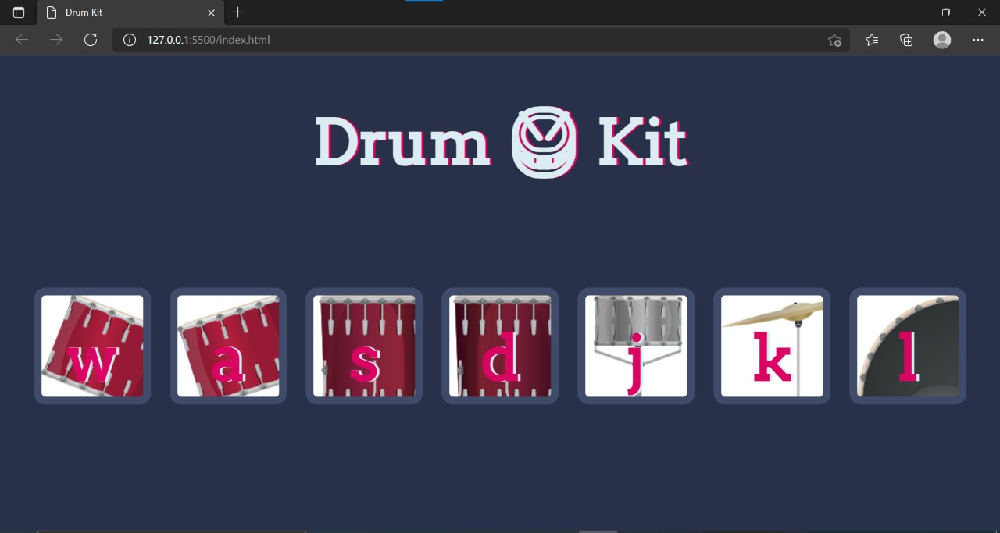

# Drum_Kit✨
A Playing Drum with sound Effects built using <strong>Javascript , HTML and CSS</strong>.

<h2>Description</h2>

It's a Web Based Application where there are different Buttons. <br>
These buttons on click produces sound to their respective Instrumental Sounds.<br>
For playing you have to just click on that respective buttons.<br>

So, What are u waiting? Try it out in the below link provided and have fun!!. 
<br>
<br>

<h2>Clone the Repository :</h2>


```bash

$ git clone https://github.com/ruhirani011/Drum_Kit

 ```
OR download as a `zip file` and extract.


<br>
<h2>👀How to Set Up in Local Pc :</h2>

- Download VsCode , Atom, or any Code - Editor you are comfortable with.<br>
- Set Up the Html Environment to run it properly in that editor.


 
<h2>Try it here :</h2>
 https://ruhirani011.github.io/Drum_Kit/
 
 <br><br>

## Have a look here:


<h2>Technologies Used :</h2>


- HTML
- CSS
- JAVASCRIPT

<!-- //[click](hhtttps) -->
